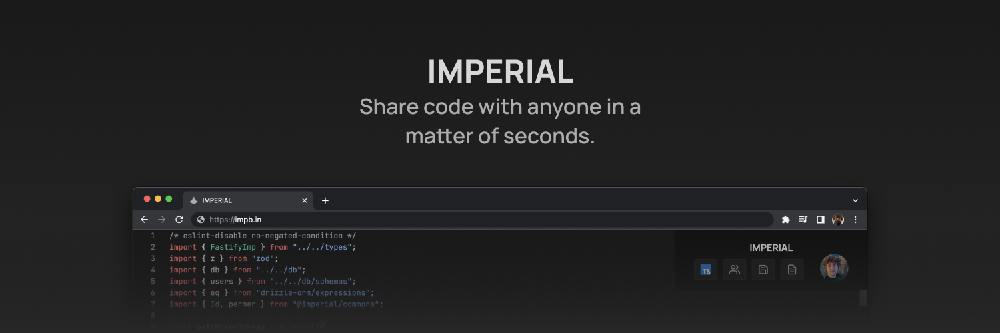

# IMPERIAL
Share code with anyone in a matter of seconds.

### Repositories
- [imperial](https://github.com/imperialbin/imperial) - Mono repo containg the API, web client, documentation and Discord bot.
- [imperial.js](https://github.com/imperialbin/imperial.js) - JavaScript SDK for IMPERIAL's API.
- [imperial.py](https://github.com/imperialbin/imperial.py) - Python SDK for IMPERIAL's API.
- [imperial-rs](https://github.com/imperialbin/imperial-rs) - Rust SDK for IMPERIAL's API.
- [imperial-vsc](https://github.com/imperialbin/imperial-vsc) - VSC extension for IMPERIAL's API.

### Keep up-to date
- [Discord](https://discord.gg/cTm85eW49D)
- [Twitter](https://twitter.com/imperialbin)
